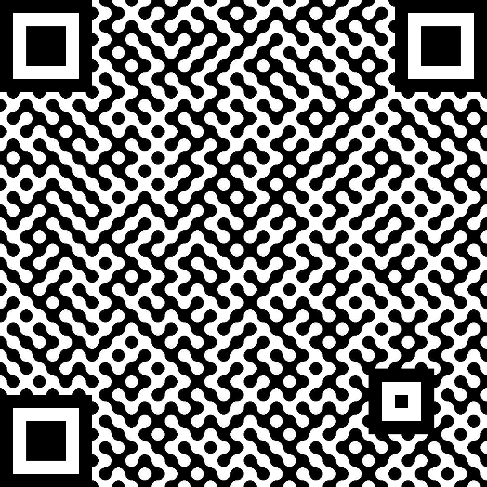

# funny-qr
A very silly QR code generator!

## CLI usage:

```sh
$ funny-qr --style bouncy --target art.png "https://www.youtube.com/watch?v=Dw0Pm0Na_6Q"
```

Or read the `--help` entry, it should be self explanatory I hope.

## Examples

Here are some generated QRs:

### Base

How QR codes work

### bouncy

The source of the idea

## Motivation

The idea was shamelessly stolen from a toot by [Dave Richeson](https://vmst.io/@divbyzero@mathstodon.xyz).
Check out his stuff, he's a cool dude™.

## Building from source

Assuming you have cargo simply run:
```sh
$ cargo install --path .
```
